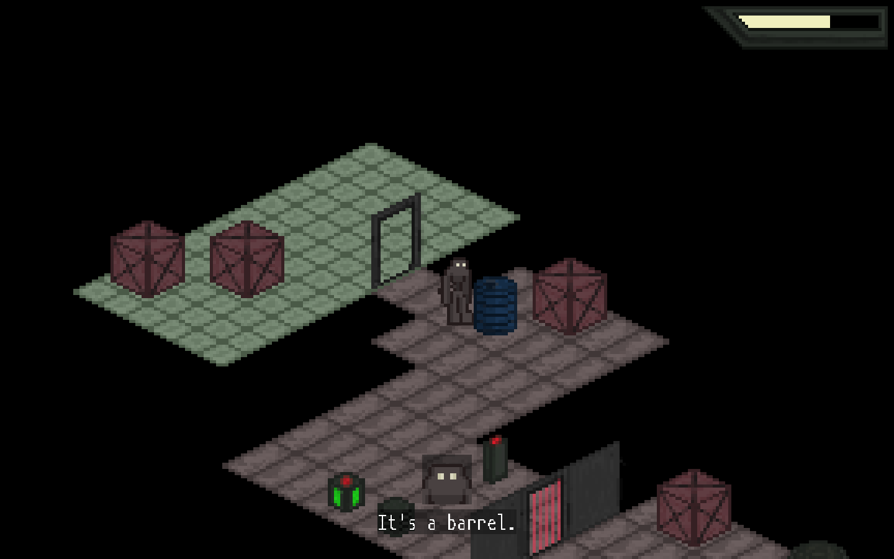

# IINDMACH

###### Copyright (C) 2022  Elijah Day

### About

IINDMACH (pronounced "second mock") is an isometric game focused around solving puzzles made up of various elements including doors, logic gates, and an ever-depleting energy bar that can only be recharged at certain points.



### Progress

Development on IINDMACH is "on hold" indefinitely.

For anyone who may be interested, there is still a sample level that can be explored included as the default starting point.  Additionally, "edit mode" can be accessed by simply passing the word "edit" as an argument to the executable.  For adding custom assets to the game, a PNG image must be placed in the "data/assets/images/" directory and the path of the image must be added to the "images.list" text file.  These can be used as tiles or entities.

### License

This program is free software; you can redistribute it and/or modify
it under the terms of the GNU General Public License as published by
the Free Software Foundation; either version 2 of the License, or
(at your option) any later version.

This program is distributed in the hope that it will be useful,
but WITHOUT ANY WARRANTY; without even the implied warranty of
MERCHANTABILITY or FITNESS FOR A PARTICULAR PURPOSE.  See the
GNU General Public License for more details.

You should have received a copy of the GNU General Public License along
with this program; if not, write to the Free Software Foundation, Inc.,
51 Franklin Street, Fifth Floor, Boston, MA 02110-1301 USA.

### Credits

Matthias Tellen's Mononoki font is licensed under the SIL Open Font
License, Version 1.1.  See "README-mononoki.md" and
"LICENSE-mononoki" (found in the "docs" directory) for more
information.

This software utilizes SDL2 for cross-platform graphics and hardware
access.  Visit [www.libsdl.org](https://www.libsdl.org/) for more information.

### Building

If you're building IINDMACH for Linux, you'll need the following packages/dependencies:
* SDL2 Development Library
* SDL2_image Development Library
* SDL2_ttf Development Library

These can be installed on Debian-based systems using the following command:
```
sudo apt install libsdl2-dev libsdl2-image-dev libsdl2-ttf-dev
```
To build and launch the game, simply run:
```
make
```
\
\
If you're building IINDMACH for Windows, you'll need MinGW-w64:
```
sudo apt install mingw-w64
```
All of the other dependencies should be in the `external/` directory.  To build and launch the game, run:
```
make OS=win64
```
Alternatively, for 32-bit binaries, run:
```
make OS=win32
```
\
\
The Makefile launches IINDMACH by default upon completing the build.  If you wish to build the game without launching it, use:
```
make build
```
\
\
All builds are placed in the `build/` directory.  To clear the directory, you can use:
```
make destroy
```


